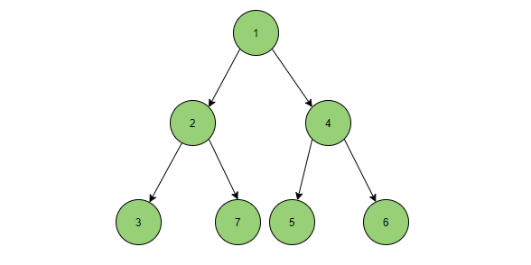
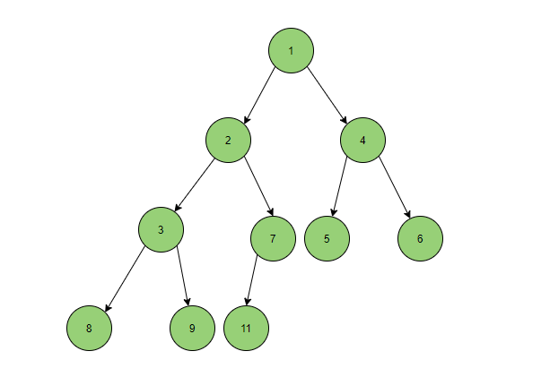
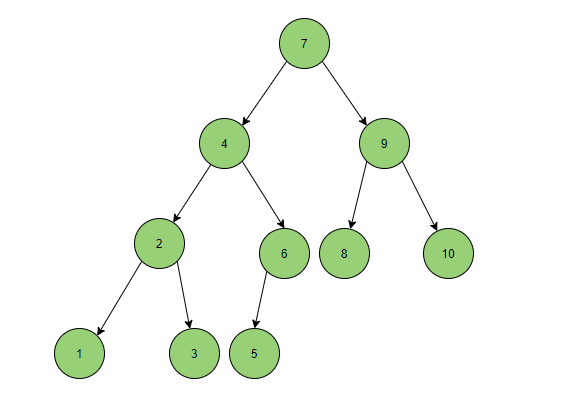
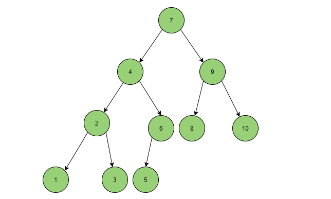
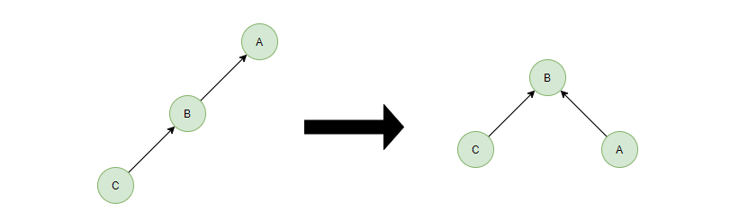
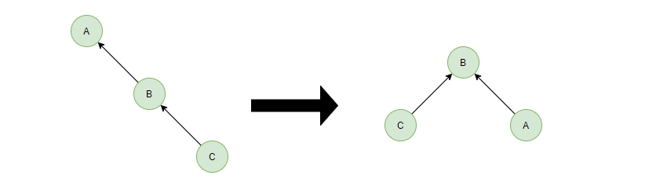
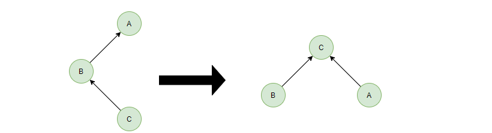
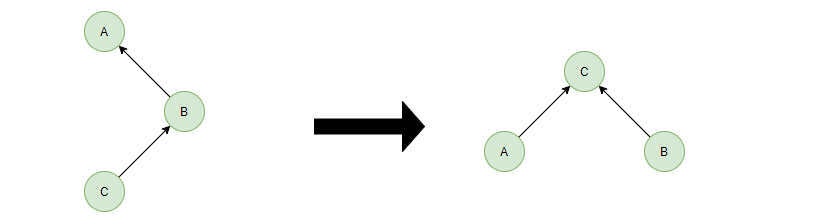

# 树

##### 树

树是一种数据结构，它是由n（n>=0）个有限节点组成一个具有层次关系的集合，把它叫做“树”是因为它看起来像一棵倒挂的树，也就是说它是根朝上，而叶朝下的。它具有以下的特点：

- 每个节点有零个或多个子节点；

- 没有父节点的节点称为根节点；

- 每一个非根节点有且只有一个父节点；

- 除了根节点外，每个子节点可以分为多个不相交的子树。

- **结点的度**：结点拥有的子树的数目，图中结点c的度为2。 

- **叶子**：度为零的结点，图中D、E、F都是叶子结点

- **树的度**：树中结点的最大的度，图中结点c的度最大为2，因此树的度为2。

- **层次**：根结点的层次为1，其余结点的层次等于该结点的双亲结点的层次加1。

- **树的高度**：树中结点的最大层次，图中树的高度为3。

- **无序树**：如果树中结点的各子树之间的次序是不重要的，可以交换位置。

- **有序树**：如果树中结点的各子树之间的次序是重要的, 不可以交换位置。 

- **森林**：0个或多个不相交的树组成。对森林加上一个根，森林即成为树；删去根，树即成为森林。

##### 二叉树

- 二叉树是每个节点最多有两个子树的树结构。它有五种基本形态：二叉树可以是空集；根可以有空的左子树或右子树；或者左、右子树皆为空。

##### 满二叉树

- **定义**：高度为h，并且由 2h –1个结点的二叉树，被称为满二叉树，其实不难看出，满二叉树的结点的度要么为0（叶子结点），要么为2（非叶子结点）

##### 完全二叉树

- **定义**：一棵二叉树中，只有最下面两层结点的度可以小于2，并且最下一层的叶结点集中在靠左的若干位置上。这样的二叉树称为完全二叉树。

- **特点**：叶子结点只能出现在最下层和次下层，且最下层的叶子结点集中在树的左部。显然，一棵满二叉树必定是一棵完全二叉树，而完全二叉树未必是满二叉树。

##### 二叉查找树

- 二叉查找树，又被称为二叉搜索树。其特点如下：设x为二叉查找树中的一个结点，x节点包含关键字key，一句话就是左孩子比父节点小，右孩子比父节点大，还有一个特性就是”中序遍历“可以让结点有序。

##### 平衡二叉树

- 一棵AVL树有如下必要条件：

1. 条件一：它必须是二叉查找树。

1. 条件二：每个节点的左子树和右子树的高度差至多为1。

- 在数据插入的时候，会破坏二叉树的平衡，这个时候需要进行平衡

- LL型

- RR型

- LR型

- RL型

##### 红黑树

- 红黑树（全称 Red-Black Tree），它是一种特殊的二叉查找树。红黑树的每个节点上都有存储位表示节点的颜色，可以是红(Red)或黑(Black)。

- 红黑树有如下的特性：

- 每个节点只有两种颜色：红色和黑色

- 根节点是黑色的

- 每个叶子节点都是黑色的空节点（NIL），也就是说，叶子节点不存数据

- 任何相邻的节点都不能同时为红色，也就是说，红色节点是被黑色节点隔开的

- 从一个节点到该节点的子孙节点的所有路径上包含相同数目的黑节点

