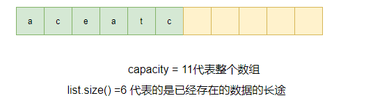
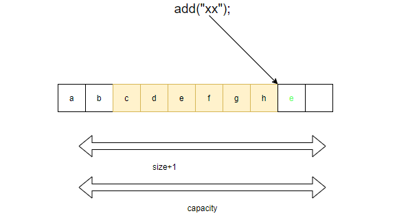
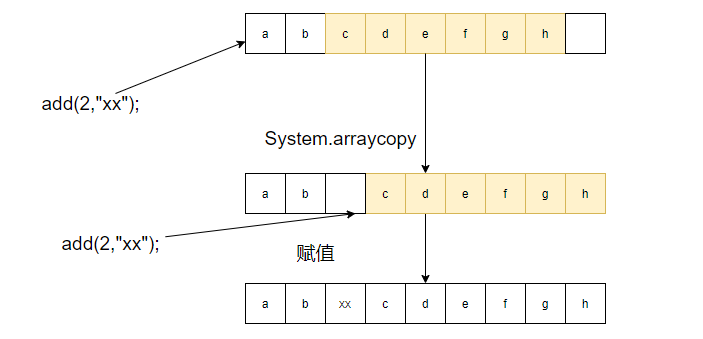
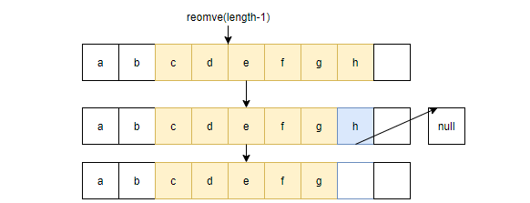

# ArrayList

#### 概念

- 原理图



- ArrayList底层使用Object[]动态数组实现的。

- 它实现了List接口。由于使用了动态数组，那么在内存就是一块连续的区间。所以ArrayList是有序可重复的，支持随机访问。同时允许放入null元素。

- ArrayList 有个成员用来表述数组中的元素。一个是size用于记录数组中实际存储的元素。一个是容量(Capacity)。用于表示底层数组的实际大小。容器内存储元素的个数不能多于当前的容器 (size<==capacity)。当容量不足时，容器会自动增大底层数组的大小(自动扩容)。线程的不安性体现在添加过程中没有进行加锁。

### 要点

##### 添加元素

- `add(E e)` ,`add(int index,E element)`,`addAll()`

- `add(E e)`



- `add(int index,E element)`原理



```java
public E remove(int index) {
        Objects.checkIndex(index, size);
        final Object[] es = elementData;

        @SuppressWarnings("unchecked") E oldValue = (E) es[index];
        fastRemove(es, index);

        return oldValue;
}    
public boolean remove(Object o) {
        final Object[] es = elementData;
        final int size = this.size;
        int i = 0;
        found: {
            if (o == null) {
                for (; i < size; i++)
                    if (es[i] == null)
                        break found;
            } else {
                for (; i < size; i++)
                    if (o.equals(es[i]))
                        break found;
            }
            return false;
        }
        fastRemove(es, i);
        return true;
    }
    private void fastRemove(Object[] es, int i) {
        modCount++;
        final int newSize;
        if ((newSize = size - 1) > i)
            System.arraycopy(es, i + 1, es, i, newSize - i);
        es[size = newSize] = null;
    }
```


- 在添加过程中。发现容量不足时。使用的时grow()方法。对容器的容量进行扩容。扩容的时机是 size==elementData.length。扩容的倍数是当前容量的1.5倍。

- 扩容原理

```java
private void add(E e, Object[] elementData, int s) {
    // 当前size与elemenData.length 相等
    if (s == elementData.length)
        elementData = grow();
    elementData[s] = e;
    size = s + 1;
}
private Object[] grow() {
        return grow(size + 1);
}
    private Object[] grow(int minCapacity) {
        return elementData = Arrays.copyOf(elementData,newCapacity(minCapacity));
    }
private int newCapacity(int minCapacity) {
    // overflow-conscious code
    int oldCapacity = elementData.length;
    // 新容量的容量的方式是旧容量的1.5倍
    int newCapacity = oldCapacity + (oldCapacity >> 1);
    if (newCapacity - minCapacity <= 0) {
        if (elementData == DEFAULTCAPACITY_EMPTY_ELEMENTDATA)
            return Math.max(DEFAULT_CAPACITY, minCapacity);
        if (minCapacity < 0) // overflow
            throw new OutOfMemoryError();
        return minCapacity;
    }
    return (newCapacity - MAX_ARRAY_SIZE <= 0)
        ? newCapacity
        : hugeCapacity(minCapacity);
}
```

##### 查找元素

- get(int index) 方法只是直接取出elementData中的值而已。返回的时候，需要对将Object重新转型为指定的类型。

```java
public E get(int index) {
    Objects.checkIndex(index, size);
    return elementData(index);
}
E elementData(int index) {
    return (E) elementData[index];
}
```

##### 修改元素

- set(int index,E element)。对指定元素进行赋值，修改。

```java
public E set(int index, E element) {
    Objects.checkIndex(index, size);
    E oldValue = elementData(index);
    elementData[index] = element;
    return oldValue;
}
```

##### 删除元素

- remove(int index) 对指定索引进行删除。使用的将索引位置的后续部分，整体往前移动，发生了一次拷贝。最后将多余的一位置为了null。

- remove(Object obj) 对obj 使用equals()相等的元素进行删除。是将符合条件的元素的索引之后的数组发生了一次拷贝。



```java
public E remove(int index) {
        Objects.checkIndex(index, size);
        final Object[] es = elementData;

        @SuppressWarnings("unchecked") E oldValue = (E) es[index];
        fastRemove(es, index);

        return oldValue;
}    
public boolean remove(Object o) {
        final Object[] es = elementData;
        final int size = this.size;
        int i = 0;
        found: {
            if (o == null) {
                for (; i < size; i++)
                    if (es[i] == null)
                        break found;
            } else {
                for (; i < size; i++)
                    if (o.equals(es[i]))
                        break found;
            }
            return false;
        }
        fastRemove(es, i);
        return true;
    }
    private void fastRemove(Object[] es, int i) {
        modCount++;
        final int newSize;
        if ((newSize = size - 1) > i)
            System.arraycopy(es, i + 1, es, i, newSize - i);
        es[size = newSize] = null;
    }
```

##### 线程安全性

- ArrayList的是线程不安全的。因为在进行数据操作的时候。如add()。remove()。方法中都没有进行加锁操作。在并发添加修改的过程中。会出现与预期值不符合的情况。

- Vector 使用的机制是在对应的方法中提供了Synchronization 

- 同时Collections也提供了对应的方法

- 在Juc包中是通过reentrantLock进行线程安全的保证

```java
List<Integer> arrays = new ArrayList<>();
Collections.synchronizedCollection(arrays);
```

- fast-fail失败机制。通过校验modCount与expectModCount是否相等来判断是否发生了并发修改。因为modCount是一个公共变量。会被不同的线程修改。就会出现与预期值不同的情况

```java
final void checkForComodification() {
    if (modCount != expectedModCount)
        throw new ConcurrentModificationException();
}
```

### Q&A

- ArrayList是什么？

- ArrayList线程安全吗？具体在哪里体现的线程不安全？

- ArrayList的快速失败机制？