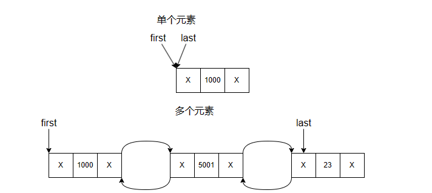
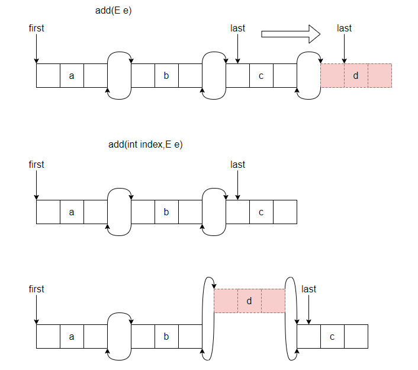

# LinkedList

## 概念

LinkedList同时实现了List接口和Deque接口。它既可以作为一个顺序容器，又可以看作一个队列(Queue)，同时又可以看作一个栈。它的底层是通过双向链表实现。LinkedList通过first和last来分别指向链表的第一个和最后一个元素。

## 原理图




- 基本结构

```java
    transient int size = 0;

    transient Node<E> first;

    transient Node<E> last;

    private static class Node<E> {
        E item;
        Node<E> next;
        Node<E> prev;

        Node(Node<E> prev, E element, Node<E> next) {
            this.item = element;
            this.next = next;
            this.prev = prev;
        }
    }
```

## 要点


- 增加元素

- `add(E e)`,` add(int index,E element)`

```java
public boolean add(E e) {
    linkLast(e);
    return true;
}
void linkLast(E e) {
    final Node<E> l = last;
    final Node<E> newNode = new Node<>(l, e, null);
    last = newNode;
    if (l == null)
        first = newNode;
    else
        l.next = newNode;
    size++;
    modCount++;    
}
public void add(int index, E element) {
    checkPositionIndex(index);

    if (index == size)
        linkLast(element);
    else
        linkBefore(element, node(index));
}
```

## 增加元素原理图



## Q&A

- 什么是LinkedList？

- LinkedList和ArrayList的区别？

- LikedList是线程安全的吗？