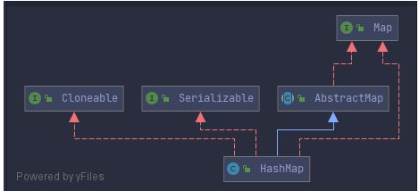
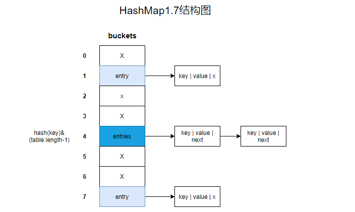

# HashMap 

## 基本概念

- HashMap是一个散列表，存储的是一个键值对。实现了map接口，根据键的hashcode值存储数据，具有很快的访问速度，key仅允许一条为null，默认为数组的头。不支持线程同步。

- hashmap是无序的，这里的无序体现在两个方面
  - 因为容器中元素的位置是根据key的hash取得的，所以元素并不能进行顺序遍历
  - 因为容器在扩容的过程中，会重新进行hash，所以在添加完数据后，遍历的结果可能会发生改变

- 核心方法

  - index = hash(key)&(cap -1);

  - hash 是对key进行的一个hash运算，这里不仅仅使用了hashcode的方法，还对生成的hashcode进行了右移，这是为了保证hashcode的高位能够参与到与运算中，这样能更均匀的分布hash。

  - cap是数组的容量，这里必须保证数组的容量是2的指数幂，这样能够保证在按位取与的过程中，所有的数组点都被获取到

- hashmap继承于AbstractMap，实现了map,Cloneable、java.io.Serializable 接口



## jdk1.8

- 实现结构
  - 使用数组+链表+红黑树


- 初始化
  - 容量一定是2的指数幂

```java
static final int tableSizeFor(int cap) {
        int n = cap - 1;
        n |= n >>> 1;
        n |= n >>> 2;
        n |= n >>> 4;
        n |= n >>> 8;
        n |= n >>> 16;
        return (n < 0) ? 1 : (n >= MAXIMUM_CAPACITY) ? MAXIMUM_CAPACITY : n + 1;
}
```

- 加载因子loadFactor
  - 用来设置Entry数组(hash表)的内存空间大小，在初始hashMap不设置参数的情况下，默认loadFactor值为0.75

- 边界值threshold
  - 用来判断是否应该进行扩容

```
threshold = (int) Math.min(capacity*loadfactor,MAXIMUN_CAPACITY+1)
```

- 扩容
  - 在jdk1.8中是resize() 方法进行map容器的初始化和扩容

- 源码分析

```java
    public V put(K key, V value) {
        return putVal(hash(key), key, value, false, true);
    }

final Node<K,V>[] resize() {
        Node<K,V>[] oldTab = table;
        int oldCap = (oldTab == null) ? 0 : oldTab.length;
        int oldThr = threshold;
        int newCap, newThr = 0;
        // 表明应该进行数组的扩容
        if (oldCap > 0) {
            // 容量已经达到最大值,不能在进行扩容了
            if (oldCap >= MAXIMUM_CAPACITY) {
                threshold = Integer.MAX_VALUE;
                return oldTab;
            }
            // 新数组新边界扩大为原数组,原边界的一倍
            else if ((newCap = oldCap << 1) < MAXIMUM_CAPACITY &&
                     oldCap >= DEFAULT_INITIAL_CAPACITY)
                newThr = oldThr << 1; // double threshold
        }
        // 数组进行初始化
        else if (oldThr > 0) // initial capacity was placed in threshold
            newCap = oldThr;
        // 数组初始化
        else {               // zero initial threshold signifies using defaults
            newCap = DEFAULT_INITIAL_CAPACITY;
            newThr = (int)(DEFAULT_LOAD_FACTOR * DEFAULT_INITIAL_CAPACITY);
        }
        if (newThr == 0) {
            float ft = (float)newCap * loadFactor;
            newThr = (newCap < MAXIMUM_CAPACITY && ft < (float)MAXIMUM_CAPACITY ?
                      (int)ft : Integer.MAX_VALUE);
        }
        threshold = newThr;
        @SuppressWarnings({"rawtypes","unchecked"})
            Node<K,V>[] newTab = (Node<K,V>[])new Node[newCap];
        table = newTab;
        // 遍历整个table数组 对每个数组上的元素进行分析
        if (oldTab != null) {
            for (int j = 0; j < oldCap; ++j) {
                Node<K,V> e;
                if ((e = oldTab[j]) != null) {
                    oldTab[j] = null;
                    if (e.next == null)
                    // 只有一个元素
                        newTab[e.hash & (newCap - 1)] = e;
                    // 是否为红黑树
                    else if (e instanceof TreeNode)
                        ((TreeNode<K,V>)e).split(this, newTab, j, oldCap);
                    else { // preserve order
                     // 是否为冲突链表 
                        Node<K,V> loHead = null, loTail = null;
                        Node<K,V> hiHead = null, hiTail = null;
                        Node<K,V> next;
                        do {
                            next = e.next;
                            // key的hash是否能对oldcap取余为0 
                            // e.hash 链表上的每一个key的hash不同 取模==0表示这个key的hash冲突后。在新的数组中
                            // 还是用原来的索引
                            if ((e.hash & oldCap) == 0) {
                                if (loTail == null)
                                    loHead = e;
                                else
                                    loTail.next = e;
                             // 使用尾插法
                                loTail = e;
                            }
                            else {
                                if (hiTail == null)
                                    hiHead = e;
                                else
                                    hiTail.next = e;
                                hiTail = e;
                            }
                        } while ((e = next) != null);
                        if (loTail != null) {
                            loTail.next = null;
                            newTab[j] = loHead;
                        }
                        if (hiTail != null) {
                            hiTail.next = null;
                            newTab[j + oldCap] = hiHead;
                        }
                    }
                }
            }
        }
        return newTab;
    }
```

- put

```java
final V putVal(int hash, K key, V value, boolean onlyIfAbsent,
                   boolean evict) {
        Node<K,V>[] tab; Node<K,V> p; int n, i;
        // 判断是否还没有进行初始化
        if ((tab = table) == null || (n = tab.length) == 0)
            n = (tab = resize()).length;
        // 已经初始化对key进行取值，若对应区域为空 直接复制
        if ((p = tab[i = (n - 1) & hash]) == null)
            tab[i] = newNode(hash, key, value, null);
        // 若发生冲突
        else {
            // key 是否为同一个
            Node<K,V> e; K k;
            if (p.hash == hash &&
                ((k = p.key) == key || (key != null && key.equals(k))))
                e = p;
            // 是否为树节点
            else if (p instanceof TreeNode)
                e = ((TreeNode<K,V>)p).putTreeVal(this, tab, hash, key, value);
            else {
            // 是否为链表
                for (int binCount = 0; ; ++binCount) {
                    // 尾部插入
                    if ((e = p.next) == null) {
                        p.next = newNode(hash, key, value, null);
                        // 进行红黑树的转化 两个条件 链表长度大于8 数组长度大于默认值64
                        if (binCount >= TREEIFY_THRESHOLD - 1) // -1 for 1st
                            treeifyBin(tab, hash);
                        break;
                    }
                    if (e.hash == hash &&
                        ((k = e.key) == key || (key != null && key.equals(k))))
                        break;
                    p = e;
                }
            }
            // 若存在旧值，返回旧值
            if (e != null) { // existing mapping for key
                V oldValue = e.value;
                if (!onlyIfAbsent || oldValue == null)
                    e.value = value;
                afterNodeAccess(e);
                return oldValue;
            }
        }
        // 用作快速失败
        ++modCount;
        // 添加数据完成之后，在进行扩容
        if (++size > threshold)
            resize();
        afterNodeInsertion(evict);
        return null;
    }
```

- get()

```java
    final Node<K,V> getNode(int hash, Object key) {
        Node<K,V>[] tab; Node<K,V> first, e; int n; K k;
        // 按照hash进行取值 若发生冲突 则对key进行相等判断
        if ((tab = table) != null && (n = tab.length) > 0 &&
            (first = tab[(n - 1) & hash]) != null) {
            if (first.hash == hash && // always check first node
                ((k = first.key) == key || (key != null && key.equals(k))))
                return first;
            if ((e = first.next) != null) {
                if (first instanceof TreeNode)
                    return ((TreeNode<K,V>)first).getTreeNode(hash, key);
                do {
                    if (e.hash == hash &&
                        ((k = e.key) == key || (key != null && key.equals(k))))
                        return e;
                } while ((e = e.next) != null);
            }
        }
        return null;
    }
```

## jdk1.7

- 实现结构
  - 数组+链表

- 插入数据使用头插法



- hashMap在扩容上有哪些优化

- 在jdk1.7的时候，扩容的每次计算都是对元素进行rehash算法，计算原来每个元素在扩容之后的hash表中的位置，而在jdk1.8过后借助2倍扩容机制，元素不需要进行重新计算位置

## Q&A

- hashMap和HashTable 的区别

- hashTable线程同步，hashMap非线程同步

- hashTable不允许键值有空值，hashMap允许键值有空值

- hashTable使用Enumeratation ，hashMap使用iterator

- hashTable中hash数组的默认大小是11，增加的方式是old*2+1,HashMap中Hash数组的默认大小是16，增长方式是2的指数倍

- hashTable继承于Dictionary，hashMap继承自AbstractMap类
