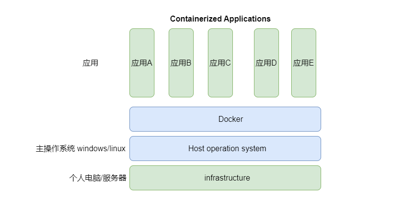
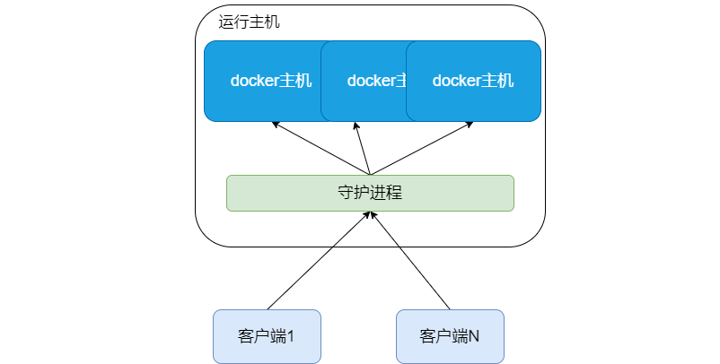
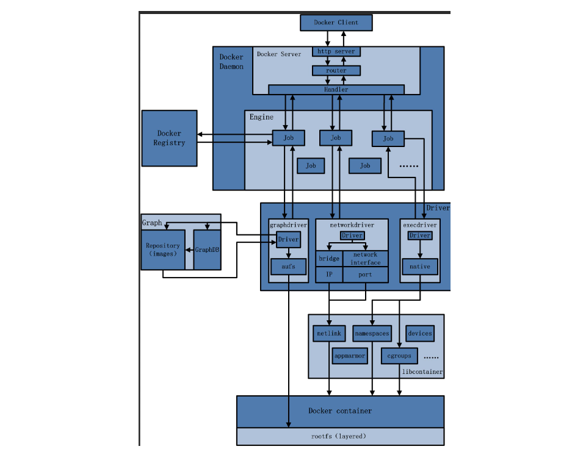
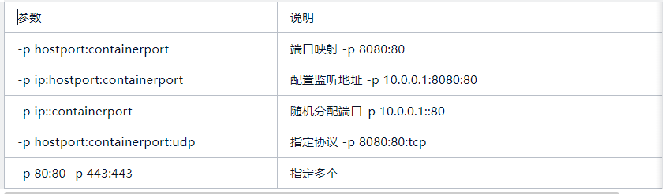
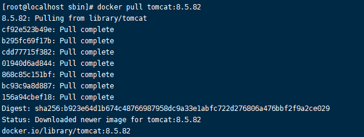
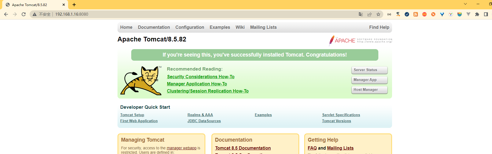

# docker基础篇

> 本文主要介绍docker的基本概念和基本使用和docker compose 对容器的编排

## 一、docker基本概念

### 1.docker

- docker是基于go语言实现的云开源项目，docker的主要目标是"build ship and run any app,anywhere".也就是通过对应用组件的封装，分发，部署，运行等生命周期的管理。使用户的app(可以是一个web应用或者数据库应用等等)，及其运行环境能够做到"一次镜像，处处运行"。

- 容器虚拟化技术

  - linux容器(Linux Containers)是与系统其它部分隔离开的一系列进程，从另一个镜像运行，并由该镜像提供进程所需的全部文件。容器提供的镜像包含了应用的所有依赖项，所以它都具有一致性和可移植性。

  - linux容器不是模拟了完整的操作系统，而是对进程进行了隔离。有了容器，就可以将软件运行所需的所有资源打包到一个隔离的容器中，容器与虚拟机不同，不需要捆绑一整套操作系统。只需要软件所需的库资源和配置。系统因次变得高效轻量，同时能够保证一致性

- docker层次

  

### 2.镜像

- docker镜像就是一个只读的模板。镜像可以用来创建docker容器。一个镜像可以创建很多容器。相当于一个root文件系统。docker镜像文件类似于java的类模板，docker中的容器实例类似于java中的new 实例对象

- image 文件可以用来生成容器

- 同一个image文件可以生成多个同时运行的容器实例

### 3.容器

- docker利用容器独立运行的一个或一组应用。应用程序或服务运行在容器里面，容器就类似于一个虚拟化的运行环境。容器是用镜像创建的运行实例。容器为镜像提供了一个标准和隔离的运行环境。它可以被启动，运行，停止，删除。每个容器都是相互隔离，保证安全的平台。

- 容器是一个简易版的linux环境(包括root用户权限，进程空间，用户控件和网络空间)和运行在其中的应用程序。

- 一个容器运行一种服务。需要的时候，通过docker客户端创建一个对应的运行实例，也就是容器

### 4.仓库

- 集中存放镜像的场所 类似于maven仓库 github仓库。

- 公开仓库

- 私有仓库

- 可以把镜像推到仓库中，也可以从仓库中拉取镜像

### 5.docker 的工作原理

- docker是一个client-server结构的系统。docker守护进程运行在主机上，然后通过socket连接从客户端访问。守护进程从客户端接受命令并管理运行在主机上的容器。容器是一个运行时环境



- docker整体架构

  - docker是一个cs的架构，后端是一个松耦合的架构，众多模块各司其职

  - 基本流程

  - 用户使用docker client与Docker Daemon建立通信，并发送请求给后者

  - Docker Daemon 作为docker架构的主体部分，首先提供docker server的功能，使其可以接受Docker Client的请求

  - Docker Engine 执行docker内部的一系列工作，每一项工作都是以一个job的形式存在

  - job的运行过程中，当需要容器镜像时，则从Docker registry中下载镜像，并通过镜像管理驱动graph driver将下载镜像以graph的形式存储

  - 当需要为docker创建网络环境时，通过网络管理驱动network driver创建，并配置docker的网络环境

  - 当需要限制docker容器运行资源或执行用户指令等操作时，则通过exec driver 来完成

  - libcontainer是一个独立的容器管理包。network driver以及Exec driver都是通过libcontainer来实现具体对容器的操作。



## 二、docker搭建基本的环境

### 1.docker的常用命令

- #### 启动类命令

  - 启动docker：`systemctl start docker`

  - 停止docker：`systemctl stop docker`

  - 重启docker：`systemctl restart docker`

  - 查看docker状态：`systemctl status docker`

  - 开启启动docker：`systemctl enable docker`

- #### 镜像命令

  - 列出本地镜像：`docker images`

    - 返回结果说明

      - repository 镜像源

      - tag：镜像标签

      - imageId：镜像id

      - created: 镜像创建时间

      - size：镜像大小

      - options

  - 列出本地所有镜像(含历史映像层): -a
    - 只显示镜像id: -q

  - 搜索镜像：`docker search [options] 镜像名字`

    - 返回结果说明

      - name 镜像名称

      - Description 镜像描述
        - stars 点赞数量

      - official 是否官方

      - Automatic 是否自动构建

      - options

    - 只列出N个镜像默认25个：--limit n

    - 举例 `docker search --limit 5 redis`

  - 下载镜像：docker pull 镜像名字[:TAG]

    - docker pull 镜像名字 没有tag的话 等价于docker pull 镜像名字:latest

  - 查看镜像/容器/数据卷所占的空间：docker system df

  - 删除镜像:    `docker rmi` 某个镜像名字ID

  - 删除单个 ：`docker rmi -f` 镜像ID	

  - 删除多个：`docker rmi -f` 镜像名1:TAG 镜像名2:TAG

  - 删除所有：`docker rmi -f` $(docker images -qa)

- #### 容器命令

  - 前提

    - 有镜像才能有容器，这是根本前提

  - 新建+启动容器`docker run [options] IMAGE [command] [ARG...]`

    - optisons 

      - --name ="容器新名字" 为容器指定一个名称

      - -d 后台运行容器，并返回容器ID，也叫启动守护式容器(后台运行)

      - -P 大写 随机端口映射

      - -p小写 指定端口映射

        

  - 重启容器
    - `docker restart` 容器id/容器名字

  - 停止容器
    - `docker stop` 容器id/容器名字
  - 进入容器
    - `docker exec -it` 容器id /bin/bash

### 2.docker搭建tomcat

- 官网
  - [Docker Hub Container Image Library ](https://hub.docker.com/)
- 拉取指定版本的镜像

```
docker pull tomcat:8.5
```



- 创建并启动容器

```
docker run -d -p 8080:8080 --name="mytomcat" tomcat:8.5.82
```

- 访问浏览器的8080 注意检查防火墙和安全组的规则是否开放对应端口

  

- 注意这个版本的tomcat会将webapp内容放入webapp.dist中，需要进入容器，处理一下即可

### 3.镜像加载的原理

- 镜像

  - docker的镜像实际上是由一层一层的文件系统组成，这种层级文件系统称之unionFs。

  - bootfs(boot file system)主要包含bootloader和kernel。bootloader主要是引导加载kernel，linux系统刚启动时会加载bootFs文件系统。在docker镜像的最底层是引导文件系统bootfs。这一层与我们典型的Linux和unix系统是一样的，包含boot加载器和内核。当boot加载完成之后，这个内核就都在内存中了。此时内存的使用权已由bootfs转交给内核。此时系统也会卸载bootfs。

  - rootfs(root file system),在bootfs之上。包含的就是典型的Linux系统中的/dev,/proc,/bin,/etc/ 等标准目录和文件。rootfs就是不同的操作系统的发行版，比如Ubuntu，centos等。

- 加载的过程

  - 当容器启动时，一个新的可写层被加载到镜像的顶部。

  - 这一次通常被称为"容器层","容器层"之下都叫做"镜像层"

  - 镜像层都是只读的，容器层是可写的。

  - 所有对容器的改动-无论添加，删除，还是修改文件都只会发生在容器层中。

    

## 三、制作镜像

### 1.使用Dockerfile制作镜像

- 概念

  - Dockerfile是用来构建镜像的文本文件，是由一条条构建镜像所需的参数和文本构成的脚本

- 基本知识

  - 每条保留字指令都必须为大写字母且后面至少要跟随一个参数

  - 指令按照从上到下顺序执行

  - \#表示注释

  - 每条指令都会创建一个新的镜像层并对镜像进行提交

- 大致流程

  - docker从基础镜像运行一个容器

  - 执行一条指令，并对容器作出修改

  - 执行类似的commit操作，提交一个新的镜像层

  - Docker再基于刚才提交的镜像运行一个新容器，

  - 执行Dockerfile中的下一条指令，直到所有指令都执行完成

- 保留字说明

  | 关键字     | 作用                                                         |
  | ---------- | ------------------------------------------------------------ |
  | FROM       | 基础镜像，当前新镜像是基于哪个镜像的？指定一个已经存在的镜像作为模板，第一条必须是from。 |
  | MAINTAINER | 镜像维护者的姓名和邮箱地址                                   |
  | RUN        | 容器构建时需要运行的命令。  Shell格式/ Exec格式 是在docker build时运行。 |
  | EXPOSE     | 暴露端口                                                     |
  | WORKDIR    | 指定在创建容器后终端默认登录的进来工作目录一个落脚点。       |
  | USER       | 指定该镜像以什么样的用户去执行，如果都不指定，默认是root。   |
  | ENV        | 用来在构建镜像过程中设置环境变量。                           |
  | VOLUME     | 容器数据卷用于数据保存和持续化工作                           |
  | ADD        | 将宿主机目录下的文件拷贝进镜像，且会自动处理url和解压tar压缩包 |
  | COPY       | 类似ADD拷贝文件和目录到镜像中，将从构建上下文目录中《源路径》的文件/目录复制到新一层镜像内的目标路径<br />COPY src dest<br />COPY [ "src","dest"] |
  | CMD        | 指定容器启动后要干的事情 Dockerfile中可以有多个CMD指令，但只有最后一个生效，CMD会被docker run之后的参数替换。 |
  | ENTRYPOINT | 用来指定一个容器启动时要运行的命令，类似于CM指令，但是ENTRYPOINT不会被docker run后面的命令覆盖，而且这些命令行参数会被当做参数送给endpoint指定的程序 |

  - ENTRYPOINT可以和CMD一起使用，一般是变参才会使用CMD，这里的CMD等于是在给ENTRYPOINT传参。当指定了ENTRYPOINT之后，CMD的含义就发生了变化，不再是直接运行其命令，而是将CMD的内容作为参数传递ENTRYPOINT

- 搭建一个具有vim指令+ip指令+jdk8的一个centos镜像

- Dockerfile

```
# 基础镜像centos7
FROM centos:centos7
# 镜像作者berry
MAINTAINER BERRY<1206>
# 设置环境变量
ENV MYPATH /usr/local
# 指定工作目录
WORKDIR $MYPATH

#安装vim编辑器，
RUN yum -y install vim
#安装ifconfig命令，查看网络IP
RUN yum -y install net-tools
#安装java8以及类库
RUN yum -y install glibc.i686
RUN mkdir /usr/local/java
#ADD是相对路径，把JDK添加到容器中，安装包必须与Dockerfile文件在同一位置
ADD jdk-8u191-linux-x64.tar.gz /usr/local/java
#配置Java环境变量
ENV JAVA_HOME /usr/local/java/jdk1.8.0_191
ENV JRE_HOME $JAVA_HOME/jre
ENV CLASSPATH $JAVA_HOME/lib/dt.jar:$JAVA_HOME/lib/tools.jar:$JRE_HOME/lib:$CLASSPATH
ENV PATH $JAVA_HOME/bin:$PATH

# 暴露端口
EXPOSE 80

CMD echo $MYPATH
CMD echo "SUCCESS*******************OK"
CMD /bin/bash
```

- 构建镜像

```
 docker build -t mycentos:1.1 .
```

- 构建命令解析
  - build 表示构建行为
  - -t 镜像的名字及标签
  - . 表示构建的path为本地

- 启动镜像

```
docker run -it mycentos /bin/bash
```

## 四、docker compose 的基本使用

### 1.简介

- [官网](https://docs.docker.com/compose/)

- Docker-Compose是docker官方的开源项目，负责实现对docker容器集群的快速编排。

- Compose是docker公司推出的一个工具软件，可以管理多快容器，组成一个应用。你需要定义一个YAML格式的配置文件。docker-compose.yaml写好多个容器之间的调用关系，然后只需要一个命令就能同时启动关闭这些容器

- Docker-compose允许用户通过一个单独的docker-compose.yam模板文件(YAML格式)来定义一组相关的应用容器为一个项目(Project)。

- 可以很容易地用一个配置文件定义一个多容器的应用，然后使用一条指令安装这个应用的所有依赖完成构建。docker compose解决了容器与容器之间如何管理编排的问题
- 总之 使用docker compose 可以不用再记录繁琐的启动命令。从yml文件就可以查看完成的信息

### 2.docker compose 使用

- 准备docker-compose.yml文件

```yaml
version: "3"
services:
# 容器名
  mysql:
# 镜像名
    image: mysql:8.0.30
# 环境变量
    environment:
      MYSQL_ROOT_PASSWORD: 'by123456'
      MYSQL_ALLOW_EMPTY_PASSWORD: 'no'
# 是否重启
    restart: always
# 指定端口
    ports:
      - "3306:3306"
# 容器卷隐射
    volumes:
      - /data/boot/mysql/db:/var/lib/mysql
      - /data/boot/mysql/conf/my.cnf:/etc/my.cnf
# 指定网络
    networks:
      - liudao
    command: --default-authentication-plugin=mysql_native_password

```

- 在docker-compose.yml目录下

```
 docker compose up -d
```

