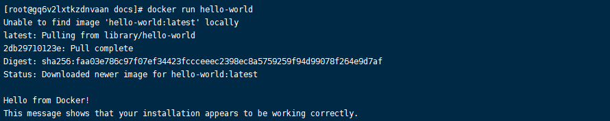

# docker安装

> 本文使用Docker version 20.10.21 版本作为代码演示
>
> CentOS7.9作为系统环境

## 一、官网

- [[Install Docker Engine on CentOS )](https://docs.docker.com/desktop/install/linux-install/)

## 二、Linux安装docker

### 1.卸载老版本

```
sudo yum remove docker \
                  docker-client \
                  docker-client-latest \
                  docker-common \
                  docker-latest \
                  docker-latest-logrotate \
                  docker-logrotate \
                  docker-engine
```

### 2.准备环境

```
yum install -y  gcc
yum install -y  gcc-c++
yum install -y yum-utils
```

### 3.设置仓库(国内镜像源)

```
# 国内镜像仓库
yum-config-manager --add-repo https://mirrors.aliyun.com/docker-ce/linux/centos/docker-ce.repo
```

### 4.重建yum索引

```
yum makecache fast
```

### 5.安装docker 引擎

```
# 这里不止安装了docker引擎，还安装了docker compose 插件
sudo yum install docker-ce docker-ce-cli containerd.io docker-compose-plugin
```

### 6.启动docker

```
systemctl start docker
```

### 7.测试docker

```
docker run hello-world
```



- 出现hello from docker 代码已经安装docker已经成功安装 同时能够正常拉取 镜像 创建容器

### 8.卸载docker

```
#卸载 Docker 引擎、CLI、Containerd 和 Docker Compose 包
sudo yum remove docker-ce docker-ce-cli containerd.io docker-compose-plugin
#主机上的映像、容器、卷或自定义配置文件不会自动删除。删除所有映像、容器和卷：
sudo rm -rf /var/lib/docker
sudo rm -rf /var/lib/containerd
```

## 三、加速镜像

### 1.镜像

- 按照上述流程可以完成docker在linux环境的正确安装。在实际的使用过程中，经常会出现，拉取镜像超时的情况。出于这样的情况考虑，可以考虑配置加速镜像和仓库

```
{
  "registry-mirrors": ["镜像地址"],
}

```

- 然后重启

```
systemctl restart docker
```

- 具体操作步骤请访问阿里云的docker镜像配置。
- 登陆阿里云控制台----搜索容器镜像服务–镜像加速器–获取加速器地址