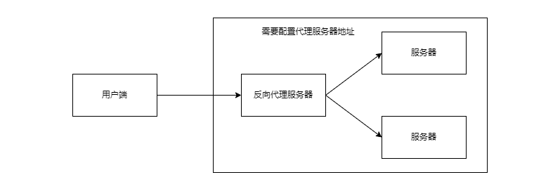

# nginx基础篇

## 一、基础概念

- Nginx全称是什么？ Nginx ("engine x") 是一个高性能的 HTTP和反向代理服务器，也是一个 IMAP/POP3/SMTP代理服务器。

## 二、nginx处理网络请求

### 1.概述

- nginx的进程模型和大多数后台服务程序一样，按职责将进程分成监控进程和工作进程两类，启动nginx的主进程充当监控进程，而由主进程fork出来的子进程则充当工作进程。

- 在nginx启动过程中，主进程就是master进程，该进程在启动各个worker进程之后，就会进入一个无限循环中，以处理客户端发送过来的控制指令；而worker进程则会进入一个循环中，从而不断接收客户端的连接请求以及处理请求。

### 2.master进程

- master进程通过接收客户端的请求，比如-s reload、-s stop等，解析这些命令之后，通过进程间通信，将相应的指令发送到各个worker进程，从而实现对worker进程的控制；

- 读取Nginx 配置文件并验证其有效性和正确性

- 建立、绑定和关闭socket连接

- 按照配置生成、管理和结束工作进程

- 接受外界指令，比如重启、升级及退出服务器等指令

- 不中断服务，实现平滑升级，重启服务并应用新的配置

- 开启日志文件，获取文件描述符

- 不中断服务，实现平滑升级，升级失败进行回滚处理

- 编译和处理perl脚本

### 3.worker进程

- 响应解析用户的请求 worke进程读取配置文件查找路径

- 接受处理客户的请求

- 将请求以此送入各个功能模块进行处理

- IO调用，获取响应数据

- 与后端服务器通信，接收后端服务器的处理结果

- 缓存数据，访问缓存索引，查询和调用缓存数据

- 发送请求结果，响应客户的请求

- 接收主程序指令，比如重启、升级和退出等

### 4.请求原型图


### 5.linux中的nginx进程


## 三、nginx基础功能

```
#开启1个进程 对应的是当前服务器cpu的物理核心
# 默认为1，表示开启一个业务进程
worker_processes  1;

events {
    # 每一个worke可以创建多少个链接
    # 单个业务进程可接受连接数
    worker_connections  1024;
}
http {
    # include 引入配置文件
    # mime.types 当前文件是什么类型的 告诉浏览器用什么方式解析返回的数据
    # 不是由浏览器的后缀名决定的，而是由返回的数据头决定浏览器呈现的方式
    # 引入http mime类型
    include       mime.types;
    # 默认的类型 
    # 如果mime类型没有匹配上，默认使用二进制流的方式传输
    default_type  application/octet-stream;

    # 减少一次拷贝的过程
    # 使用linux的sendfile(socket，file，len)高效网络传输，也就是数据0拷贝
    sendfile        on;

    # 保持链接超时时间
    keepalive_timeout  65;

    #虚拟主机 vhost
    server {
        # 监听端口号
        listen       80;
        server_name  localhost;# 域名 主机名
		# 指定的uri资源
        location / {
        # nginx 主目录的html
            root   html;
       	# 默认页
            index  index.html index.htm;
        }
        # 出错之后，跳转到/50.x.html
        error_page   500 502 503 504  /50x.html;
        location = /50x.html {
            root   html;
        }
    }

}

```


### 1.nginx零拷贝

- 概念

  - 指定是否使用sendfile系统调用来传输文件。sendfile系统调用在两个文件描述符之间直接传递数据(完全在内核中操作)，从而避免了数据在内核缓冲区和用户缓冲区之间的拷贝，操作效率很高，被称之为零拷贝

- 使用方式

  - 语法： `sendfile on/off;`

  - 默认值： `sendfile on;`

  - 上下文： http，server，location，if in location

- 传统文件传输与nginx比较
  - 传统文件传输
    - 调用read函数，文件数据拷贝到内核缓冲区(磁盘高速缓存)
    - read函数返回，数据从内核缓冲区到用户缓冲区

    - 调用read/send函数，将数据从用户缓冲区拷贝到内核socket缓冲区

    - 数据从内核socket缓冲区拷贝到协议引擎中

    - 文件数据经过了四次拷贝操作：硬盘->内核缓冲区->用户缓冲区->内核socket缓冲区->协议引擎


- sendfile文件传输方式
  - sendfile系统调用利用DMA引擎将文件数据拷贝到内核缓冲区，之后数据被拷贝到内核socket缓冲区中
  - DMA引擎将数据从内核socket缓冲区拷贝到协议引擎中。

  - 这里没有用户态和内核态之间的切换，也没有内核缓冲区和用户缓冲区之间的拷贝，大大提升了传输性能。（实际上只调用了sendfile，sendfile告诉要从哪个文件，哪个字节开始读取，读取多少个字节。将读取出来的字节发送到哪个socket上面，相当于正常情况下减少了拷贝次数。）

  - 文件经历了两次拷贝操作：硬盘—>内核缓冲区—>内核socket缓冲区—>协议引擎

  - 注意

  - sendfile当启用directio的时候，directio会禁用sendfile，diectio更加适合大文件。


- 当文件大小超过8M，启动AIO和directio

```
location /video/ {
   sendfile on;
   aio on;
   directio 8m;
}
```


### 2.虚拟主机

- 定义
  - 虚拟主机是一种特殊的软硬件技术，它可以将网络上的每一台计算机分成多个虚拟主机，每个虚拟主机可以独立对外提供 www 服务，这样就可以实现一台主机对外提供多个 web 服务，每个虚拟主机之间是独立的，互不影响的。


- 规则

  - 基于IP的虚拟主机
  
  -  基于域名的虚拟主机
  
  - 基于端口的虚拟主机
  
  -  对于Nginx来说，每个server就是一个虚拟主机
  
  - serverName+端口 确定唯一

- server_name匹配规则

  - 有序性
    - servername匹配分先后顺序，写在前面的匹配上就不会继续往下匹配了。

  - 完全匹配
    - server_name vod.mmban.com www1.mmban.com;


   - 通配符开始匹配
        - server_name *.mmban.com

  - 通配符结束匹配
    - server_name vod.*;


  - 正则匹配
    
    - server_name ~^[0-9]+\.mmban\.com$
    - ~代表正则开始
    - $代表正则结束
    - 尽量不要用正则匹配，相当于每一次请求都会发生计算。当请求数上去之后，性能会发生下降。
    


- conf文件配置

```shell
server {
   # 域名+端口
   listen       81;
   server_name  admin.liudaolunhui.com;

   location / {
        root   /data/www/admin;
        index  index.html index.htm;
   }
   error_page   500 502 503 504  /50x.html;
   location = /50x.html {
       root   html;
   }
}
server {
# ip+端口
   listen       83;
   server_name  192.168.1.16;

   location / {
        root   /data/www/admin;
        index  index.html index.htm;
   }
   error_page   500 502 503 504  /50x.html;
   location = /50x.html {
       root   html;
   }
}
```

### 3.代理

- 正向代理

  - 简介

    - 正向代理类似一个跳板机，代理访问外部资源。
    
    - 我是一个用户，我访问不了某网站，但是我能访问一个代理服务器，这个代理服务器,他能访问那个我不能访问的网站，于是我先连上代理服务器,告诉他我需要那个无法访问网站的内容，代理服务器去取回来,然后返回给我。
  
  
    - 场景
  
      - 访问原来无法访问的资源，如google
      
      - 可以做缓存，加速访问资源
      
      - 对客户端访问授权，上网进行认证
      
      - 代理可以记录用户访问记录（上网行为管理），对外隐藏用户信息
  
  
    - 核心 
      - 代理服务器是和用户在一起的，服务端并不能准确知道用户的访问，它的来源都是来自于代理服务器
  
    - uml类图
  


- 反向代理

  - 简介

    - 反向代理（Reverse Proxy）是指以代理服务器来接受internet上的连接请求，然后将请求转发给内部网络上的服务器，并将从服务器上得到的结果返回给internet上请求连接的客户端，此时代理服务器对外就表现为一个服务器。
    
    -  我是一个用户，我要访问某网站，我直接请求，但是网站是有代理的。通过代理访问到其他的服务器地址。
  
  
    - 场景
  
      - 保证内网的安全，可以使用反向代理提供WAF功能，阻止web攻击
      
      - 负载均衡，通过反向代理服务器来优化网站的负载
  
    - 核心
  
      - 客户端是无感知代理的存在的，反向代理对外都是透明的，访问者者并不知道自己访问的是一个代理。因为客户端不需要任何配置就可以访问。
  

  - uml类图



- ngx_http_proxy_module模块代理 

```
# server中的代理是http
location / {
    proxy_pass http://baidu.com;
    # root   html;
    # index  index.html index.htm;
}

```

- 注意
  - proxy_pass和root/index 是相互冲突的，二者只能选一个
  - proxy_pass后面没有任何URL路径信息（比如/，/xxx等），请求会保持原来的请求地址。
  - proxy_pass后面有URL路径信息，反向代理的地址去掉location中的匹配部分。

- 举例说明nginx中proxy_pass的路径有/和无/的区别

  - 访问`http://192.168.1.16/proxy/index.html`

  - 代理模式一

    ```bash
    location  /proxy/ {
        proxy_pass http://127.0.0.1:8080;
    }
    # 实际请求到的地址是 http://192.168.1.16/proxy/index.html
    ```

  - 代理模式二

    ```bash
    location  /proxy/ {
        proxy_pass http://127.0.0.1:8080/;
    }
    # 实际请求到的地址是 http://192.168.1.16/index.html
    ```

  - 代理模式三

    ```bash
    location  /proxy/ {
        proxy_pass http://127.0.0.1:8080/order;
    }
    # 实际请求到的地址是 http://192.168.1.16/orderindex.html
    ```

  - 代理模式四

    ```bash
    location  /proxy/ {
        proxy_pass http://127.0.0.1:8080/order/;
    }
    # 实际请求到的地址是 http://192.168.1.16/order/index.html
    ```

### 4.负载均衡

- 定义
  - 就是把用户的请求按照指定的方式均衡的分配给集群中的每台服务器，从而不会产生集群中大量请求只请求某一台服务器，从而使该服务器宕机的情况。


- 负载均衡算法

  - 轮询
    - 默认情况下使用轮询方式，逐一转发，这种方式适用于无状态请求。


  - weight(权重)
    - 指定轮询几率，weight和访问比率成正比，用于后端服务器性能不均的情况。


  - ip_hash
    - 根据客户端的ip地址转发同一台服务器，可以保持回话。


  - least_conn
    - 最少连接访问


  - url_hash
    - 根据用户访问的url定向转发请求


  - fair
    - 根据后端服务器响应时间转发请求

    - 除了轮询和权重 其他负载均衡算法，很少启用

    - 在连接的时候这些算法会造成流量的倾斜，而服务器本身是存在性能的优劣的


- 配置文件

```
# down 表示关机
# backup表示备份,没有节点的时候才会开启
upstream httpd {
   ip_hash;
   server 127.0.0.1:8050 weight=10 down; 
   server 127.0.0.1:8060 weight=1; 
   server 127.0.0.1:8060 weight=1 backup; 
}
```


### 5.动静分离

- 定义
  - 为了提高网站的响应速度，减轻程序服务器（Tomcat，Jboss等）的负载，对于静态资源，如图片、js、css等文件，可以在反向代理服务器中进行缓存，这样浏览器在请求一个静态资源时，代理服务器就可以直接处理，而不用将请求转发给后端服务器。对于用户请求的动态文件，如servlet、jsp，则转发给Tomcat，Jboss服务器处理，这就是动静分离。即动态文件与静态文件的分离。


- 原理
  - 动静分离可通过location对请求url进行匹配，将网站静态资源（HTML，JavaScript，CSS，img等文件）与后台应用分开部署，提高用户访问静态代码的速度，降低对后台应用访问。通常将静态资源放到nginx中，动态资源转发到tomcat服务器中。


- location说明

  - 语法规则

    - location [=|~|~*|^~] /uri/ { … }

    - = 开头表示精确匹配
    
    -  ^~ 开头表示uri以某个常规字符串开头，理解为匹配 url路径即可。nginx不对url做编码，因此请求为/static/20%/aa，可以被规则^~ /static/ /aa匹配到（注意是空格）。以xx开头
    
    - ~ 正则匹配，区分大小写
    
    - ~* 正则匹配，不区分大小写
    
    - / 通用匹配，任何请求都会匹配到。
    
    -  !~和!~*分别为区分大小写不匹配及不区分大小写不匹配 的正则
    
    - / 通用匹配，任何请求都会匹配到。
  
  
    - 隐藏规则
  
      - 首先精确匹配 =->其次以xx开头匹配^~->然后是按文件中顺序的正则匹配->最后是交给 / 通用匹配。
      - 当有匹配成功时候，停止匹配，按当前匹配规则处理请求。
      -  对于 location / 只有其他location未能成功匹配的时候才使用此规则
      - ~*/(js|img|fonts)
      - ~代表开启正则
      - *代表不区分大小写
  


- 配置信息

```shell
//以xx开头
location ^~ /static/ {    
  root /webroot/static/;
}

//以xx结尾
location ~* \.(gif|jpg|jpeg|png|css|js|ico)$ {   
  root /webroot/res/;
}
```

- alias与root主要区别在于nginx如何解释location后面的uri，这会使两者分别以不同的方式将请求映射到服务器文件上
  - root指定的目录是location匹配访问的path目录的上一级目录,这个path目录一定要是真实存在root指定目录下的；
  - alias指定的目录是准确的，即location匹配访问的path目录下的文件直接是在alias目录下查找的; 
  - 使用alias标签的目录块中不能使用rewrite的break（具体原因不明）；另外，alias指定的目录后面必须要加上"/"符号!!!! 
  - root目录配置中，location匹配的path目录后面带不带"/"，都不会影响访问。
- 举例说明nginx中location的路径alias和root的区别
  - 准备
    - 在nginx的html目录 新建文件夹order和proxy 在文件夹里面放入index.html

  - 配置文件
  - alias 实例地址


```
    server {	
       listen       8080;
       server_name  localhost;
       location /proxy/ {
            alias  /usr/local/nginx/html/proxy/;
            index  index.html index.htm;
       }
    }
# 请求地址
#http://192.168.1.16:8080/proxy/index.html
```

- root 实例

```
    server {
       listen       8080;
       server_name  localhost;
       location /order/ {
            root   html;
            index  index.html index.htm;
       }
    }
# 请求地址
#http://192.168.1.16:8080/order/index.html
```

### 6.URLRewrite

- 定义
  - rewrite是实现URL重写的关键指令，根据regex(正则表达式)部分内容，重定向到repacement，结尾是flag标记。主要用来隐藏后端服务器的真实地址


- 语法

  - rewrite  \<regex>    \<replacement>  [flag];

  - 关键字  正则     替代内容    flag标记

- flag标记说明

  - last  本条规则匹配完成后，继续向下匹配新的locationURI规则
  - break  本条规则匹配完成即终止，不再匹配后面的任何规则
  - redirect 返回302临时重定向，浏览器地址栏会显示跳转后的URL地址 每一次请求都会询问服务器
  - permanent  返回301永久重定向，浏览器地址栏会显示跳转后的URL地址  第一次请求的时候 会询问服务器，后续均为浏览器自行处理

- regex常用正则表达式

  | **字符**  | **描述**                                                     |
  | --------- | ------------------------------------------------------------ |
  | \         | 将后面接着的字符标记为一个特殊字符或一个原义字符或一个向后引用。如“\n”匹配一个换行符，而“\$”则匹配“$” |
  | ^         | 匹配输入字符串的起始位置                                     |
  | $         | 匹配输入字符串的结束位置                                     |
  | *         | 匹配前面的字符零次或多次。如“ol*”能匹配“o”及“ol”、“oll”      |
  | +         | 匹配前面的字符一次或多次。如“ol+”能匹配“ol”及“oll”、“oll”，但不能匹配“o” |
  | ?         | 匹配前面的字符零次或一次，例如“do(es)?”能匹配“do”或者“does”，"?"等效于"{0,1}" |
  | .         | 匹配除“\n”之外的任何单个字符，若要匹配包括“\n”在内的任意字符，请使用诸如“[.\n]”之类的模式。 |
  | (pattern) | 匹配括号内pattern并可以在后面获取对应的匹配，常用$0...$9属性获取小括号中的匹配内容，要匹配圆括号字符需要Content |

  

- 优劣

  - 优点

      - 掩藏真实的url以及url中可能暴露的参数，以及隐藏web使用的编程语言，提高安全性便于搜索引擎收录。


  - 缺点

      - 降低效率，影响性能。如果项目是内部使用，不必配置。

  - 演示

  ```
      server {
          listen       80;
          server_name  localhost;
          rewrite ^/(.*) http://192.168.1.16:8080/$1 permanent;
      }
  # http://192.168.1.16:80/order/index.html
  会发生跳转
  # http://192.168.1.16:8080/order/index.html
  ```

### 7.防盗链

- 定义

  > 盗链是指服务提供商自己不提供服务的内容，通过技术手段绕过其它有利益的最终用户界面（如广告），直接在自己的网站上向最终用户提供其它服务提供商的服务内容，骗取最终用户的浏览和点击率。受益者不提供资源或提供很少的资源，而真正的服务提供商却得不到任何的收益。

  - nginx防盗链

    - valid_referers none | blocked | server_names | strings ....;

    - 可以同时携带多个参数，表示多个 referer 头部都生效。
  
    - none， 检测 Referer 头域不存在的情况。
  
    - blocked，请求头Referer字段不为空（即存在Referer），但是值可以为空（值被代理或者防火墙删除了），并且允许Referer不以“http://”或“https://”开头，通俗点说就是允许“http://”或"https//"以外的请求。
  
  
    - server_names ，设置一个或多个 URL ，检测 Referer 头域的值是否是这些 URL 中的某一个。
  
  
    - 其他字符串类型：检测referer与字符串是否匹配，如果匹配则允许访问，可以采用通配符*
  
  - referer的头域在请求头中存在全局invalid_referer 变量
  
  
    - 允许访问时变量值为空
  
  
    - 不允许访问时变量值为 1


- 配置信息

```bash
server {
   listen       80;
   server_name  192.168.1.16;
   location / {
      valid_referers  127.0.0.1;
      if ($invalid_referer) { 
      	return 403; 
       }
   }
   error_page   403 /403.html;
   location = /403.html {
       root   html;
   }
   error_page   500 502 503 504  /50x.html;
   location = /50x.html {
       root   html;
   }
}

```


- 添加refer 通过post请求


### 8.高可用配置

- 定义
  - 在nginx做反向代理的负载均衡的过程中，只有一个nginx节点，服务器有宕机的风险，为了解决这个风险，使用软件keepalived提高nginx


- keepalived

  - 官网
    - [http://www.keepalived.org](http://www.keepalived.org/)


  - 定义
    - 软件起初是专为LVS负载均衡软件设计的，用来管理并监控LVS集群系统中各个服务节点的状态，后来又加入了可以实现高可用的VRRP功能。因此，Keepalived除了能够管理LVS软件外，还可以作为其他服务（例如：Nginx、Haproxy、MySQL等）的高可用解决方案软件。Keepalived 一方面具有配置管理LVS的功能，同时还具有对LVS下面节点进行健康检查的功能，另一方面也可实现系统网络服务的高可用功能。


- 功能

    - 管理LVS负载均衡软件
    - 实现LVS集群节点的健康检查中

    - 作为系统网络服务的高可用性（failover）


  - 准备

    - 两台服务器(虚拟机)

  - 安装


```
yum install -y keepalived
```

- 修改主节点配置文件
- `/etc/keepalived/keepalived.conf`

```
! Configuration File for keepalived

#全局定义块
global_defs {
   router_id LB_102
}
#VRRP 实例定义块
vrrp_instance VI_101 {
    # 表明是主机
    state MASTER
    # 跟随的网卡
    interface ens33
    # 路由id
    virtual_router_id 101
    # 优先权
    priority 100
    advert_int 1
    # 认证方式，在同一个网络中的 需要保持一致
    authentication {
        auth_type PASS
        auth_pass 1234
    }
    # 定义一个漂移ip
    virtual_ipaddress {
        192.168.1.200
    }
}

```


- 修改从节点配置文件

```
! Configuration File for keepalived
#全局定义块
global_defs {
   router_id LB_101
}
#VRRP 实例定义块
vrrp_instance VI_102 {
    # 表明是备用机
    state BACKUP
    # 跟随的网卡
    interface ens33
    # 取值范围0-255
    virtual_router_id 101
    # 优先权
    priority 50
    # 检查间隔，默认1秒 VRRP心跳包的发送周期，单位为s 组播信息发送间隔，两个节点设置必须一样（实际并不一定完全是10秒，测试结果是小于10秒的随机值）
    advert_int 1
    # 认证方式，在同一个网络中的 需要保持一致
    authentication {
        auth_type PASS
        auth_pass 1111
    }
    # 定义一个漂移ip
    virtual_ipaddress {
        192.168.1.200
    }
}

```

- 注意ip要同一网段

- 这是最小配置，后续根据情况自行研究

```
# 启动主节点 从节点
systemctl start keepalived
```

- 停止主节点nginx之后，从节点的nginx的ip addr 的ens33网卡(不同机器不一样)会出现虚拟机配置

### 9.Https

- http协议的不安全

  - 协议的分类

    - 请求的底层是socket协议

    - TCP/IP协议进行了一次封装

    - http是应用层协议 

        - 包含两个部分
        - header 包含各种参数
        - body 真实的请求内容


  - htpp协议的不安全性是因为无法保证在传输过程是不会被劫持的,用户使用http传输的时候，在通过网关集合的时候，传输的格式是数据包，可以通过http协议的方式对数据进行解包，那么用户发出的数据，就是明文


#####  

- 防火墙
  - 不论是在用户侧的防火墙还是在服务侧的防火墙，只能防护本机，病毒清理，端口屏蔽。但是在传输过程中出现的劫持，是无法得到保护的。

- 安全协议
  - 双方达成共识，例如劳动合同。

  - 对称加密

  - 客户端使用加密算法，将要传输的数据进行加密，服务器端使用同样的加密算法，对数据进行解密，在返回数据的时候，同样使用加密算法，对结果进行加密，返回给客户端。

  - 弱点
    - 内置在服务器端，加密算法是开源的，劫持之后是可以进行暴力解密的。

- 非对称加密
  - https的底层算法

  - 引入计算因子 公钥+私钥 

  - 私钥在互联网中不能进行传递

  - 用户通过443端口下载公钥，

  - 用户将明文+公钥+加密算法 组成密文

  - 密文在网络中传输

  - 服务器端使用私钥+加密算法将密文解密成明文

  - 服务器端处理完数据之后，用私钥+加密算法将明文转换为密文转换给客户端

  - 用户用公钥+加密算法将密文解开

- 注意
  - 单纯的非对称加密算法并不是安全的，因为网关集群被劫持之后，可能会返回给用户一个自己的公钥，当用户用网关公钥加密，网关集群用自己的私钥进行解密，然后再发给真实的服务器。这样用户的请求就被劫持了。

  - CA机构的存在能够保证非对称加密算法的安全性

- nginx配置https
  - 重新编译nginx 
  - 在nginx 的解压目录下 执行


```
# 添加模块
./configure --prefix=/usr/local/nginx --with-http_stub_status_module --with-http_ssl_module
# 编译
make
```

- 准备对应的证书放到对应的目录
- nginx.conf 配置文件

```
   server {
        listen 443 ssl;
        server_name  域名;
        ssl_certificate      /usr/cert/xxxxx.cn.pem;
        ssl_certificate_key  /usr/cert/xxxxx.cn.key;
        ssl_session_cache  shared:SSL:1m;
        ssl_session_timeout 5m;
        ssl_ciphers ECDHE-RSA-AES128-GCM-SHA256:ECDHE:ECDH:AES:HIGH:!NULL:!aNULL:!MD5:!ADH:!RC4;
        ssl_protocols TLSv1 TLSv1.1 TLSv1.2;
        ssl_prefer_server_ciphers on;
        location / {
           proxy_pass http://127.0.0.1:8080;
       }
    }
```

