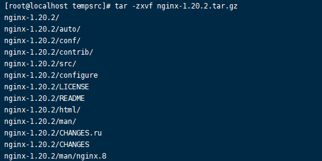
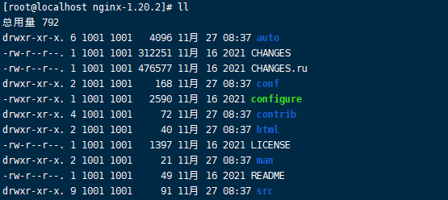

# nginx-安装

> 本文使用nginx-1.20.2 版本作为代码演示
>
> windows10 以及CentOS7.9作为系统环境

## 一、官网

- [nginx官网](https://nginx.org/en/)

## 二、Windows环境安装Nginx

### 1.下载安装包

- 下载地址
  - [nginx下载地址](https://nginx.org/en/download.html)
- 解压下载文件


- 当前目录打开cmd 执行

  ```
  start nginx 
  ```

注意默认打开就会出现闪退 没有影响 直接访问localhost即可

- 打开浏览器访问 localhost


### 2.常用命令

- 在nginx解压后的目录 打开cmd
- 启动nginx

```
E:\nginx-1.20.2>start nginx
```

- 停止nginx

```
E:\nginx-1.20.2>nginx.exe -s stop
```

- 重新载入Nginx

```bash
E:\nginx-1.20.2>nginx.exe -s reload
```

- 打开日志文件

```
E:\nginx-1.20.2>nginx.exe -s reopen
```

- 查看nginx版本

```
E:\nginx-1.20.2>nginx -v
```

## 三、Linux环境安装Nginx

### 1.需要安装gcc环境

```
yum install gcc-c++
```

### 2.第三方的开发包

- **PCRE**(Perl Compatible Regular Expressions)是一个Perl库，包括 perl 兼容的正则表达式库。nginx的http模块使用pcre来解析正则表达式
- **zlib**库提供了很多种压缩和解压缩的方式，nginx使用zlib对http包的内容进行gzip
- **OpenSSL** 是一个强大的安全套接字层密码库，囊括主要的密码算法、常用的密钥和证书封装管理功能及SSL协议，并提供丰富的应用程序供测试或其它目的使用。

```
yum install -y pcre pcre-devel

yum install -y zlib zlib-devel

yum install -y openssl openssl-devel
```

### 3.下载linux版nginx，上传服务器，解压nginx

- 下载地址

  [nginx: download](https://nginx.org/en/download.html)

- 上传到任意目录

  

- 解压

```
tar -zxvf nginx-1.20.2.tar.gz
```



### 4.使用configure 命令

configure 在解压后的nginx目录下，



```
./configure --prefix=/usr/local/nginx 
```

### 5.安装

进入nginx解压后的目录

```
make & make install
```

### 6.启动

在安装后的目录 进入/usr/local/nginx/sbin,执行命令

```
./nginx
```

### 7.常用命令

- 测试配置文件

```
./nginx -t
```


- 重新加载nginx

```
./nginx -s reload
```

- 指定配置文件加载

```
./nginx -c /usr/local/nginx/conf/nginx.conf
```

### 8.nginx加入系统命令

```
#新建文件
vim /usr/lib/systemd/system/nginx.service

```

```
[Unit]
Description=nginx - high performance web server
Documentation=http://nginx.org/en/docs/
After=network.target remote-fs.target nss-lookup.target
 
[Service]
Type=forking
PIDFile=/usr/local/nginx/logs/nginx.pid
ExecStartPre=/usr/local/nginx/sbin/nginx -t -c /usr/local/nginx/conf/nginx.conf
ExecStart=/usr/local/nginx/sbin/nginx -c /usr/local/nginx/conf/nginx.conf
ExecReload=/bin/kill -s HUP $MAINPID
ExecStop=/bin/kill -s QUIT $MAINPID
PrivateTmp=true
 
[Install]
WantedBy=multi-user.target

```

```
# 刷新命令
systemctl daemon-reload
# 开机启动
systemctl enable nginx

```

- nginx已成功加入系统命令

### 9.nginx的配置文件

```bash

#user  nobody;
worker_processes  1;

#error_log  logs/error.log;
#error_log  logs/error.log  notice;
#error_log  logs/error.log  info;

#pid        logs/nginx.pid;


events {
    worker_connections  1024;
}


http {
    include       mime.types;
    default_type  application/octet-stream;

    #log_format  main  '$remote_addr - $remote_user [$time_local] "$request" '
    #                  '$status $body_bytes_sent "$http_referer" '
    #                  '"$http_user_agent" "$http_x_forwarded_for"';

    #access_log  logs/access.log  main;

    sendfile        on;
    #tcp_nopush     on;

    #keepalive_timeout  0;
    keepalive_timeout  65;

    #gzip  on;

    server {
        listen       80;
        server_name  localhost;

        #charset koi8-r;

        #access_log  logs/host.access.log  main;

        location / {
            root   html;
            index  index.html index.htm;
        }

        #error_page  404              /404.html;

        # redirect server error pages to the static page /50x.html
        #
        error_page   500 502 503 504  /50x.html;
        location = /50x.html {
            root   html;
        }

        # proxy the PHP scripts to Apache listening on 127.0.0.1:80
        #
        #location ~ \.php$ {
        #    proxy_pass   http://127.0.0.1;
        #}

        # pass the PHP scripts to FastCGI server listening on 127.0.0.1:9000
        #
        #location ~ \.php$ {
        #    root           html;
        #    fastcgi_pass   127.0.0.1:9000;
        #    fastcgi_index  index.php;
        #    fastcgi_param  SCRIPT_FILENAME  /scripts$fastcgi_script_name;
        #    include        fastcgi_params;
        #}

        # deny access to .htaccess files, if Apache's document root
        # concurs with nginx's one
        #
        #location ~ /\.ht {
        #    deny  all;
        #}
    }


    # another virtual host using mix of IP-, name-, and port-based configuration
    #
    #server {
    #    listen       8000;
    #    listen       somename:8080;
    #    server_name  somename  alias  another.alias;

    #    location / {
    #        root   html;
    #        index  index.html index.htm;
    #    }
    #}


    # HTTPS server
    #
    #server {
    #    listen       443 ssl;
    #    server_name  localhost;

    #    ssl_certificate      cert.pem;
    #    ssl_certificate_key  cert.key;

    #    ssl_session_cache    shared:SSL:1m;
    #    ssl_session_timeout  5m;

    #    ssl_ciphers  HIGH:!aNULL:!MD5;
    #    ssl_prefer_server_ciphers  on;

    #    location / {
    #        root   html;
    #        index  index.html index.htm;
    #    }
    #}

}


```

### 10.常见问题

- 完成上文的操作，nginx已经实现了最简单的环境的搭建。在这个过程中，常见的问题有
  - linux系统的防火墙没有打开。
  - 云主机的安全组没有配置，或者没有备案，导致无法使用80端口规则。(切换其它端口即可)

