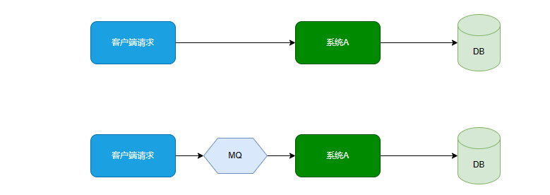
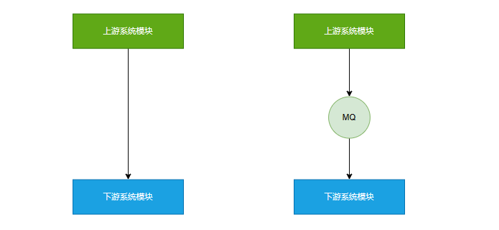
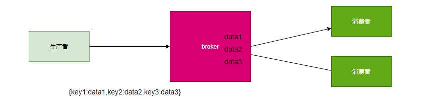
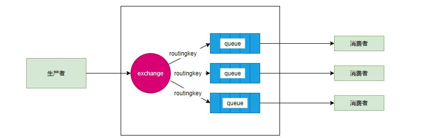

# Mq 基础

- mq定义

  - message queue 本质上是一个FIFO的队列，队列中存储的是message。是一种跨进程的通信机制，用于上下游传递消息，不依赖于其他服务。

  - 有别于同步的通信 阻塞（http）因为同步通信会导致整个流程的不够流畅

  - 消息队列解决的是异步通信的问题，屏蔽了底层复杂的通讯协议，定义了一套基于应用层的，更加简单的通讯协议。提出了基于生产-消费模型。提供了一个SDK给用户，让用户自定义生产者，消费者，然后就可以实现消息通讯而无视底层的通讯协议。

- mq作用

  - 流量削峰

    - Mq可以将系统的超量请求暂存其中，以便系统后期可以慢慢处理，从而避免了请求的丢失或系统被压垮

      

  - 应用解耦

    - 上游系统对下游系统的调用若为同步调用，则会大大降低系统的吞吐量与并发度，且系统的耦合度太高。而异步调用则会解决这些问题。所以两层之间若要实现由同步到异步的转化，一般性的做法是，在两层之间添加一个mq层

      

  - 异步处理
  - 数据收集

- 主流的mq

  - rocketMq

    - 出自阿里巴巴，使用java语言实现。在电商领域有订单，交易，充值，流计算，消息推送，日志流式处理等有不错的表现

    - 优点:单机吞吐量万级，可用性非常高，分布式架构，消息可以做到0丢失。Mq功能较为完善。扩展性好，支持10亿级别的消息堆积。不会因为消息堆积而性能下降，可以阅读源码，定制Mq。

    - 缺点:支持的客户端语言不多，目前仅支持java和C++

    - 场景：电商领域 金融互联网 可靠性要求高

  - rabbitMq

    - 2007年发布的基于AMQP协议基础上完成的，可复用的企业消息系统，基于erlang语言实现的。

      - 优点：erlang语言的高并发性，性能较好。吞吐量达到万级。支持多种语言。社区活跃度高。更新频率高。

      - 缺点：学习成本高

    - 场景：中小型公司 对吞吐量性能要求相对不高的公司

  - kafka

    - 大数据领域的消息中间件

    - 优点：性能高，能达到百万级别的吞吐量

    - 缺点：社区更新慢

    - 场景：大数据领域

##### 主流mq产品比对

- ActiveMq
  - ActiveMq是使用java语言开发的一款产品。早起很多公司与项目中都在使用。单现在的社区活跃度已经很低，现在的项目已经很少在使用了

- RabbitMq
  - RabbitMq是使用Erlang语言开发的一款mq产品。其吞吐量较kafka与RocketMq要低，且由于不是java语言开发。所以公司内部对其定制化开发难度较大

- kakfa
  - kakfa是使用scala/java 语言开发的一款产品。其最大的特点就是高吞吐量，常用于大数据领域的实时计算，日志采集，等场景。其没有遵循任何常见的mq协议。而是使用自研协议。

- rocketMq
  - rocketMq是使用java语言开发的一款mq产品。经过数年阿里双11的考验，性能与稳定性非常高，其没有遵循任何常见的mq协议，而是使用自研协议。

- 对比

| 关键词     | ActiveMq | RabbitMq | KAFKA                 | ROCKETMQ              |
| ---------- | -------- | -------- | --------------------- | --------------------- |
| 开发语言   | java     | Erlang   | java                  | Java                  |
| 单机吞吐量 | 万级     | 万级     | 十万级                | 十万级                |
| topic      | -        | -        | 百万级topic影响吞吐量 | 百万级topic影响吞吐量 |
| 社区活跃度 | 低       | 高       | 高                    | 高                    |

- 按broker分类

  - 有broker
    - broker作为消息的中转站，所有的消息都围绕其运转。生产者只需要将消息发送到broker就结束了。消费者只需要轮询broker。或者broker主动推送消息。

  - 重topic
    - kafka，JMS(ActiveMq)属于这个流派，生产者会发送key和数据到broker。由broker比较key之后决定给哪个消费者。这种模式下的topic往往是一个比较大的概念，整个系统可能就只有几个topic。这种流派的消息队列更强调的是性能而非灵活性。

- 轻topic		
  - rabbitMq作为其中的代表。生产者发送key和数据到broker。消费者定义订阅的队列。broker收到key后按照一定的逻辑计算key对应的队列。然后把数据交给队列

- 这种模式解耦了生产的key和queue。在这种模式下queue是非常轻量级的，在rabbitmq的话，这个就取决于你的内存。消费者关系的只有自己绑定的queue。生产者只需要关心自己的key就行。

- 在AMQP这种模式下，交换机有四种类型

  - Direct exchange

  - fanout exchange

  - topic exchange

  - headers exhange

  - 这种结构的架构给通讯带来了很大的灵活性。如果在业务场景中需要很强的灵活性，可以选这个。

- 无broker
  - zeromq 它被设计成为了一个库，而不是中间件，在它的实现机制里是没有broker的

- 节点通讯之间的消息都是发在彼此的队列中，每个节点都既是生产者又是消费者，zeromq所做的就是封装出的类似于一套socket的api用于，用于发送和接收数据。

- zeromq可以实现同一台机器的rpc通信，也可以实现不同机器的Tcp和UDP通信

##### Mq常见协议

- 一般情况下，Mq的实现是要遵循一些常规性协议的。常见的协议如下

- jms
  - jms java messaging serveice java消息服务，是java平台上有关MOM (message Oriented middleware)，面向消息的中间件，po 面向过程/oo面向对象/ao面向切面 的技术规范。它便于消息系统中的java应用程序进行消息交换，并且通过提供标准的产生，发送，接收消息的接口，简化企业应用的开发。ActiveMq是该协议的典型实现。

- stomp
  - streaming Text Oriented message protocol 是一种MOM设计的简单文本协议，STOMP提供了一个可互操作的连接格式，允许客户端与任意STOMP 消息代理进行交互。ActiveMq是该协议的典型实现。RabbitMq通过插件可以支持该协议

- Amqp
  - Advanced Message Queuing Protocol（高级消息队列协议），一个提供统一消息服务的应用层标准，是应用层协议的一个开放标准，是一种MOM设计。基于此协议的客户端与消息中间件可传递消息，并不受客户端/中间件不同产品，不同开发语言等条件的限制。rabbitMq是该协议的典型实现。

- Mqtt
  - message Queuing telemetry transport （消息队列遥测传输）,是IBM开发的一个即时通讯协议，是一种二进制协议，主要用于服务器和低功耗IOT（物联网）设备间的通信。该协议支持所有平台。几乎可以把所有联网物品和外部连接起来。被用来当作传感器和制动器的通信协议。RabbitMq通过插件可以支持该协议。