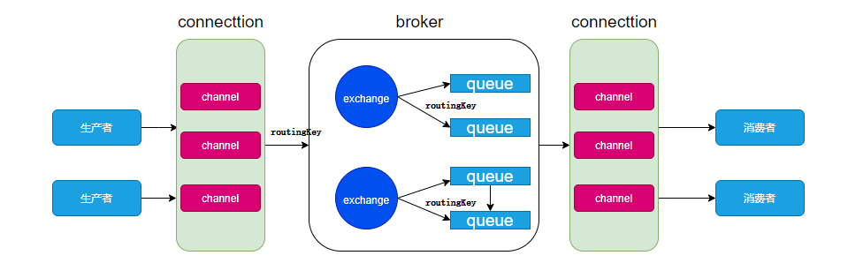
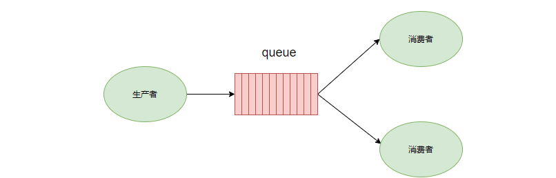
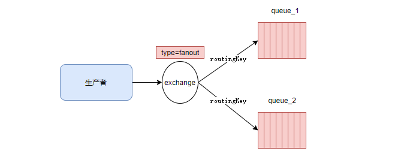
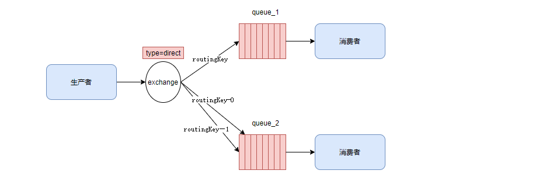
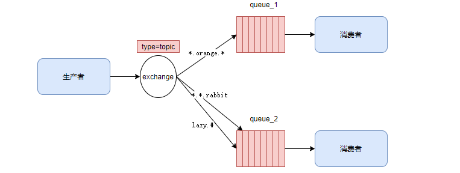

# rabbit-mq基础

## 一、概念

- 它是一个消息中间件，用于接收，存储和转发消息数据。

## 二、mq的主要组件

- 生产者

  - 产生数据，发送消息的程序

- 消费者

  - 接受数据，消费信息的程序

- 交换机

  - 接收来自生产者的消息，同时将接收到的消息推送到队列中。交换机必须确切的知道如何处理它接收到的消息，这个由交换机的类型决定。

- "" 无名交换机

- 直接(direct),

- 主题(topic),

- 标题(headers)

- 扇出(fanout)1

  队列

  - 队列是RabbitMq内部使用的一种数据结构。尽管消息经过RabbitMq和应用程序，但它们只能存储在队列中。队列受主机的内存和磁盘的约束，本质上是一个大的消息缓冲区。许多生产者可以将消息发送到一个队列，许多消费者可以从一个队列接收数据。从生产者发送的消息到这里等待被消费者取走

- 信道 channel

  - channel是connecttion内部建立的逻辑链接。channel作为轻量级的Connection极大的减少了操作系统建立tcp connection的开销。

- binding

  - exchange和queue的虚拟连接，binding中可以包含routingkey。binding信息保存到exchange的查询表中。用于message的分发依据。

- routingkey

  - 原理中的第一个指的是当前消息被谁接收

  - 第二个指的是当前exchange下。什么样的routingkey会被绑定到queue中


## 三、rabbot-mq操作

- 生产者的发布确认
  - 原理
    - 生产者将信道设置为confirm模式，在信道上发布的消息都会指派给一个唯一的ID（从1开始），一旦消息被投递到所有匹配的队列之后。broker就会发送一个确认给生产者。(包含消息的唯一ID)，这就使得生产者知道消息已经正确到达目的队列了，如果消息和队列是可持久化的，那么确认消息会在消息写入磁盘之后发出，broker回传给生产者的确认消息中delivery-tag域包含了确认消息的序列号，此外broker也可以设置basic.ack的multiple域，表示到这个序号之前的所有消息都得到了处理
    - confirm模式是异步的，发送一条消息之后，在等待消息确认的同时可以继续发布消息。当消息最终得到确认之后，生产者可以通过回调的方法来处理该确认消息。若Mq因为自身错误导致消息丢失，也会发送一条nack消息，生产者也可以在回调方法中处理nack消息
    - 开启发布确认


```java
channel.confirmSelect();
```

- 单个发布确认	

  - 同步确认发布方式，发布一个消息之后，只有它被确认发布之后，后续的消息才能继续被发布。


  - 缺点：发布速度特别慢。在未收到确认消息的时候，会阻塞所有后续消息的发布


- 批量发布确认
  - 同步确认发布方式，先发布一批消息，然后一起确认。极大提高吞吐量。

  - 缺点：由于是批量确认，一旦出错，不知道是那个消息段出现的问题。

- 异步发布确认
  - 异步确认发布方式

  - 缺点：实现逻辑较为复杂

  - 消费消息的应答

- 自动
  - 消息发送完成之后，立即被认为发送成功。这种模式需要在高吞吐量和数据传输安全性方面做权衡。这种模式仅适用于消费这可以高效并以某种速率处理消息的情况下使用。这种自动应答的模式没有对传递的消息的数量进行限制。若消费者消费不及时，造成数据积压。消耗尽内存，会导致消费者的线程被操作系统kill。channel关闭。消息就丢失。

- 手动
  - 消费者处理对应逻辑完成之后，手动返回ack。通知队列处理完了。队列才删除消息。手动应答，可以批量应答从而减少网络拥堵。手动应答，消息是不会丢失，会重新入队。

- 代码显示

```java
// 用于肯定确认
/**
*mutiple:批量
    true: 代表批量应答channel上未应答的消息
          比如说channel上传送tag的消息有5，6，7，8.当前的tag是8.那么5，6，7这些还未应答的消息都会被确认得到应答
    false:只会应答tag=8的消息
**/
channel.basicAck(long deliveryTag, boolean multiple);
// 用于否定确认
channel.basicNack();
// 用于否定确认 相比basicNack少一个参数，不处理该消息，直接拒绝。将其丢弃
channel.basicReject();
// 切换手动与自动
// 将参数改为false即可
channel.basicConsume(QUEUE_NAME, false, deliverCallback, cancelCallback);
```

- 消息重新入队
  - 消息消费手动确认模式下，若消费者由于某些原因失去连接，导致消息未发送ack确认，RabbitMq将了解到消息未完全处理，并对其重新进行排队。若此时其他消费着可以处理，就会分配给另一个消费者。

- 持久化
  - 概念
    - rabbitMq退出或出于某种原因崩溃时，它会丢失消息和队列。确保消息不会丢失，需要做两件事

  - 队列持久化
  - 在声明队列的时候，把durable参数设置为持久化


```java
//设置durable参数为true

channel.queueDeclare(QUEUE_NAME,true,false,false,null);
```

- 消息持久化	
  - 在消息发送的时候，对发送者的消息进行持久化


```java
channel.basicPublish("",QUEUE_NAME, MessageProperties.PERSISTENT_TEXT_PLAIN,message.getBytes(StandardCharsets.UTF_8));
```


## 四、rabbit-mq的工作原理



## 五、rabbit-mq的6种工作模式

- **简单模式**


- 简单模式下无需指定交换机，通过默认的交换机 default。他是一种direct类型的交换机。

```java
/**
 * 生产者
 */
public class Producer {
    private static final String QUEUE_NAME = "hello";

    public static void main(String[] args) throws IOException, TimeoutException {
        //1.创建连接工厂
        ConnectionFactory factory = new ConnectionFactory();
        //2.配置信息
        factory.setHost("116.62.148.139");
        factory.setUsername("admin");
        factory.setPort(5672);
        factory.setPassword("admin123");
        //3.创建连接
        Connection connection = factory.newConnection();
        //4.创建信道
        Channel channel = connection.createChannel();
        //5.生成一个队列
        /**
         * 1.队列名称
         * 2.队列里面的消息是否持久化(磁盘) 默认情况消息存储在内存中
         * 3.队列时候只供一个消费者消费，是否进行消息共享，true 表示可以多个消费者消费，false 只能一个消费者消费
         * 4.是否自动删除 最后一个消费者断开链接后，队列是否自动删除 true 表示自动删除 false表示不自动删除
         * 5.其他参数
         */
        channel.queueDeclare(QUEUE_NAME,false,false,false,null);
        //6.发消息
        String message ="hello message test";
        //7.发送消息
        /**
         * 1.发送到哪个交换机
         * 2.路由的key是哪个， 本次是队列的名称
         * 3.其他参数信息
         * 4，发送消息的消息体
         */
        channel.basicPublish("",QUEUE_NAME,null,message.getBytes());
        System.out.println("消息发送完毕");
    }
}
```

```java
/**
 * 消费者
 */
public class Consumer {
    private static final String QUEUE_NAME = "hello";

    public static void main(String[] args) throws IOException, TimeoutException {
        ConnectionFactory connectionFactory = new ConnectionFactory();
        connectionFactory.setHost("116.62.148.139");
        connectionFactory.setUsername("admin");
        connectionFactory.setPassword("admin123");
        Connection connection = connectionFactory.newConnection();

        Channel channel = connection.createChannel();
        /**
         * 1.消费哪个队列
         * 2.消费成功后是否要自动应答 true 代表自动应答 false 代表手动应答
         * 3.消费者成功消费的回调
         * 4.消费者取消消费的回调用
         */
        //声明
        DeliverCallback deliverCallback = (consumerTag,message)->{
            System.out.println("message = " + new String(message.getBody()));
        };
        CancelCallback callback = consumerTag->{
            System.out.println("消息消费被中断");
        };
        channel.basicConsume(QUEUE_NAME,true,deliverCallback,callback);

    }
}
```


- **work模式**



- work模式采用的也是默认的default AMQP交换机。work模式下，多个消费者可以监听同一个队列，这时Queue中的消息会被平均分摊给多个消费者进行处理，而不是每个消费者都收到所有的消息并处理。
- 轮询分发
- 一个消费者消费一条，**按均分配**，woek模式下默认是采用轮询分发方式。
- 公平分发
- 根据消费者的消费能力进行公平分发，处理得快的分得多，处理的慢的分得少，**能者多劳**。
- 公平分发模式下我们需要修改RabbitMQ的配置，**第一**是将消息确认模式改为手动确认，**第二**是将预处理模式更改为每次读取1条消息，在消费者未返回确认之前，不再进行下一条消息的消费

```java
    public static void main(String[] args) throws Exception {
        Connection connection = RabbitMqUtils.getConnection();
        Channel channel = connection.createChannel();
        // 预取值=0 默认值 表示轮询
        // 预取值=1 表示开启公平分发 根据每个消费者处理效率来决定分发
        // 预取值>1 表示设置未确认的消息缓冲区的大小 
        channel.basicQos(1);
        DeliverCallback deliverCallback =(consumerTag, message)->{
            System.out.println("c2接收到的消息是" + new String(message.getBody()));
            try {
                TimeUnit.SECONDS.sleep(20);
            } catch (InterruptedException e) {
                e.printStackTrace();
            }
            channel.basicAck(message.getEnvelope().getDeliveryTag(),false);
        };
        channel.basicConsume(QUEUENAME,false,deliverCallback,consumerTag -> {});
    }
```

- 预取值
  - channel.basicQos(num) 这个方法设置的是通道上允许的未确认消息的最大数量。一旦数量达到配置的数量，RabbitMq将停止在通道上传递更多的消息，除非至少有一个未处理的消息被确认。

- 补充
  - 消息应答和QOS对用户的吞吐量有重大影响，通常增加预取值将提高向消费者传递的速度。虽然自动应答传输消息速率是最佳的，但是，在这种情况下，已传递但未处理的消息的数量也会增加，从而增加消费者的RAM消耗。

  - 预取值为1是最保守的。但这也会使吞吐量变得很低。

- **publish/sucribe模式**
  - 消息发送给不同类型的消费者。做到发布一次，消费多个。




- 交换机的类型为fanout
  - 生产者不是直接操作队列，而是将数据发送给交换机，由交换机将数据发送给与之绑定的队列

- **routing**
  - 每个消费者监听自己的队列，并且设置routingkey。

  - 生产者将消息发给交换机，由交换机根据routingkey来转发消息到指定的队列




- 交换机类型为direct

- **topic模式**
  - 每个消费者监听自己的队列，并且设置带统配符的routingkey。

  - 生产者将消息发给broker，由交换机根据routingkey来转发消息到指定的队列。




- 交换机类型为topic

- *(星号)可以代替一个单词

- \#(井号)可以代替零个或多个单词

- **rpc模式**